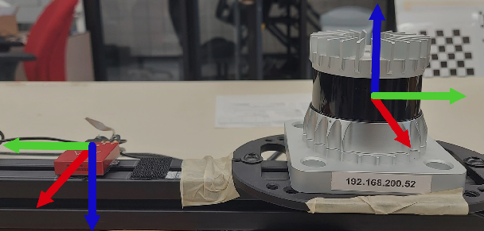

# Awesome-LiDAR-IMU-calibration     

> :sunglasses: A current list of LiDAR-IMU calibration method

## Introduction  

LiDAR and IMU are among the widely used sensors in the field of self-driving cars and robotics. To fuse both sensors and use them for algorithms (such as SLAM), it is essential to obtain the exact extrinsic parameter.  

Inspired by [Deephome/Awesome-LiDAR-Camera-Calibration](https://github.com/Deephome/Awesome-LiDAR-Camera-Calibration), this repository summarizes the LiDAR-IMU calibration methods currently being studied in research fields and related toolboxes.  

  
The figure above is one of the figures in the paper "Target-free Extrinsic Calibration of a 3D-Lidar and an IMU".

## Related papers  
Target means calibration target.  
**"S"** means spatial information (Transformation matrix) and **"T"** means temporal information (time offset).  

|Paper|Published|Target|Key words|Code|  
| --- | --- | --- | --- | --- |
|3D Lidar-IMU Calibration Based on Upsampled Preintegrated Measurements for Motion Distortion Correction|[ICRA 2018](https://ieeexplore.ieee.org/document/8460179)|S+T|IMU Preintegration, Plane association|X|  
|Targetless Calibration of LiDAR-IMU System Based on Continuous-time Batch Estimation|[IROS 2020](https://ieeexplore.ieee.org/abstract/document/9341405)|S|Continous time trajectory, Surfel map|[LI-Calib](https://github.com/APRIL-ZJU/lidar_IMU_calib)|
|Target-free Extrinsic Calibration of a 3D-Lidar and an IMU|[MFI 2021](https://ieeexplore.ieee.org/abstract/document/9591180)|S|EKF based|[imu_lidar_calibration](https://github.com/unmannedlab/imu_lidar_calibration)|  
|3D LiDAR/IMU Calibration Based on Continuous-Time Trajectory Estimation in Structured Environments|[IEEE Access 2021](https://ieeexplore.ieee.org/abstract/document/9543701)|S|Continuous-Time Trajectory, Gaussian process(GP) regression|X|  
|Observability-Aware Intrinsic and Extrinsic Calibration of LiDAR-IMU Systems|[TRO 2022](https://ieeexplore.ieee.org/abstract/document/9787062)|S|LI-Calib extension version|[OA-LICalib](https://github.com/APRIL-ZJU/OA-LICalib)|  
|Paper|Published|Target|Key words|Code|  
|Paper|Published|Target|Key words|Code|  

## Other toolboxes  

|ToolBox|Keywords|
| --- | --- |
|[SensorsCalibration](https://github.com/PJLab-ADG/SensorsCalibration)|Calibration Toolbox for Autonomous Driving|  
|[chennuo0125-HIT/lidar_imu_calib](https://github.com/chennuo0125-HIT/lidar_imu_calib)|Only calculate extrinsic rotation parameter|
|[ethz-asl/lidar_align](https://github.com/ethz-asl/lidar_align)|Accurate results require highly non-planar motions|
